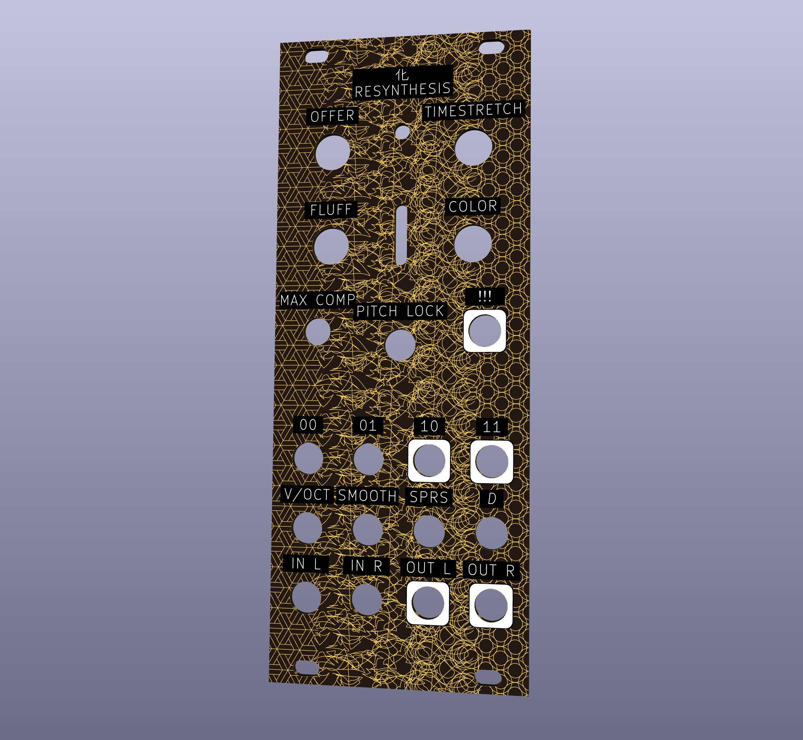

# Resynthesis

This example implements a resynthesis effect for the Electro-Smith Daisy Patch.Init(), initially inspired by [the All Electric Smart Grid project](https://github.com/jvictor0/theallelectricsmartgrid) but it grew towards a granular direction as I added additional processing / while iterating on the output sounds. **This is maybe 90% GPT (🤖), 10% human, so buyer beware if you fork this or use this code.** There are plenty of bugs.

The panel design has most of the development hours, I wanted to procedurally generate it from the KiCad files for Patch.Init():



I've sent this off to the fab, and will make any updates once I've test fitted it on my actual Patch.Init(). Those labels for the pots may be too low...

The panel generation code could pretty easily be adapted to generate panels for any synth module, though the drill diameters and tolerances are currently hardcoded and basically tailored for the jacks / pots / switches you see in many Eurorack modules. The background pattern-to-pattern interpolation... I wish I could take credit. See [the agent session](AGENT_SESSION.md) for the blow by blow on how that came to be.

Incoming audio is analyzed into overlapping FFT grains, processed spectrally (phase propagation, V/OCT pitch, spectral flattening, bright/dark tilt, sparsity, and phase diffusion), and resynthesized with overlap-add back to the output. The V/OCT input (0–10 V) sets the fundamental frequency so the module can be used as an oscillator in a bass patch.

### Offline tests vs hardware signal path

The offline tests under `test/` are designed for **analysis and regressions**, not for level‑matched listening against the live module:

- **V/OCT harmonic tests (`make voct`, `test/test_resynth_voct.cpp`)**  
  - The processed passes are rendered **100% wet** with **no dry mix, no compressor, and no soft clip**.  
  - Grains are normalized only by hop size and active‑grain count, which keeps the **internal DSP stable** but typically yields WAVs that are **much quieter than the dry input**.  
  - This is intentional: the goal is **stable spectra and reliable note detection** (CSV/SVG analysis, suggested‑note checks), not loudness parity with the original sample or with the hardware output.

- **Harmonic engine tests (`make samples` → `test_resynth_harmonic`, `out/harmonic/*.wav`)**  
  - These also run the simplified harmonic resynth engine **fully wet** without the Patch‑SM output chain (no OFFER dry path, no post‑clip compressor, no panel‑driven MAX COMP).  
  - As a result, the harmonic test WAVs can also sit **significantly below** the level of the source material even though the spectra and pitch tracking match the intended behaviour.

- **Hardware firmware (`Resynthesis.cpp`)**  
  - On the Daisy Patch SM, the same core engine is wrapped in a **full output path**: OFFER dry/wet crossfade, hop/overlap‑aware wet gain smoothing, **smoothing‑dependent loudness compensation**, **soft clipping**, and a **fixed compressor/optional MAX COMP** stage.  
  - This chain is where the “finished instrument” loudness lives; the offline tests intentionally **omit** it so they can focus on **spectral behaviour, pitch stability, and CV‑to‑pitch mapping**.

If you A/B the `make voct` / harmonic WAVs against the original samples or the hardware output, expect them to be **significantly quieter**; treat them as **analysis fixtures**, not as loudness‑matched renderings of the module.

## Title: 化 (huà)

The panel uses the single character **化** (*huà*) as its primary title, from the *Daodejing* (道德經) in the sense of **transformation**—the change of one state into another, as in the phrase **化而欲作** (*huà ér yù zuò*, “when transformation arises, desire stirs”; ch. 37). Here it evokes the transformation of incoming sound through the phase vocoder into new timbres and textures.

**Panel typography:** All panel text is set in **all caps** using the open-source DIN-style font **[Gidole](https://github.com/larsenwork/Gidole)** (OFL licence; also available via [Google Fonts](https://fonts.google.com/specimen/Gidole)). The SVG uses the `Gidole` font family with fallbacks (DIN Alternate, DIN 2014, sans-serif) so the panel renders correctly even if Gidole is not installed.

## Make Targets

- **`make` / `make all`**: Build everything for this project (no tests are run): `libDaisy`, `DaisySP`, the `Resynthesis` firmware, host test binaries in `test/`, panel preview PNGs, and the SVG/PDF block‑diagram documentation.
- **`make program`**: Flash the built firmware image to the connected Daisy Patch SM.
- **`make openocd`**: Start OpenOCD for JTAG/SWD debug sessions.
- **`make debug`**: Build a debug firmware image and launch a GDB session against OpenOCD (with logging enabled as described below).
- **`make panel`**: Generate high‑resolution PNG previews of the front‑panel art in `panel/ResynthesisPanel.png` and `panel/ResynthesisPanel_eurorack_overlay.png` (requires Inkscape).
- **`make svg`**: Generate the US Letter block diagram of the audio path in `doc/Resynthesis_BlockDiagram_USLetter.pdf` and `doc/Resynthesis_BlockDiagram_USLetter.svg` (requires Graphviz `dot`).
- **`make test_resynth`**: Build and run the offline V/OCT sweep test; outputs WAVs into `test/out/voct_sweep/`.
- **`make test_cv_sweeps`**: Build and run the CV parameter sweep tests; outputs WAVs into `test/out/cv_sweep/` and `test/out/cv_sweep_maxcomp/`.
- **`make test_panel`**: Run the panel alignment / mechanical checks in `panel/test_panel_alignment.py`.
- **`make tests`**: Run the full test suite (`test_resynth`, `test_cv_sweeps`, and `test_panel`), regenerating WAVs under `test/out/`.
- **`make clean`**: Remove build artifacts and generated assets for this project (host test binaries, `test/out` WAVs, panel PNGs, and block‑diagram PDF/SVG/DOT files).

## Controls and panel mapping

This section is the **source of truth for panel labels and control behaviour**. Labels assume the **default CV bank** (no swapping).

### Potentiometers (CV_1–CV_4)

- **CV_1 – OFFER – send + dry/wet (panel: `OFFER`)**  
  Combined send and mix control for the resynthesis engine. **Fully CCW**, the output is **purely dry input** (non‑pitch‑shifted), and the engine effectively stops seeding new grains, so if no grains are currently active you hear a clean bypass. As you turn toward **12 o’clock**, the input is increasingly **“offered” to the grain engine** while a crossfade brings in the wet signal; around noon you get roughly **half dry, half wet** with the input actively feeding grains. **Fully CW** behaves like a **full send into the resynth path** so the output is dominated by loud, fully wet grains.  
  When **PITCH LOCK is on**, OFFER additionally becomes a **“pitch crossfade”**: CCW you hear the original, unshifted input; CW you hear a **clearly pitched, harmonically focused granular reconstruction** whose fundamental and partials follow the V/OCT voltage and **COLOR** setting, with most of the grain energy collapsing onto those harmonic families. Sweeping OFFER from CCW → CW in this case moves smoothly from dry, unshifted audio into the **fully pitch‑shifted, harmonically reinforced voice**, while existing grains are still allowed to **decay naturally** when you come back toward CCW.

- **CV_2 – Time‑Stretch / Grain Density (panel: `TIMESTRETCH`)**
  Bipolar control around 1× time. This knob controls how quickly grains are launched relative to the analysis hop: **left of centre** slows down and smears the audio into super‑slow, cloud‑like textures, while **right of centre** increases grain density and motion up into fast, chattery clusters. The mapping mirrors the TIME CV input so that the **0 V / noon region** covers the most musically useful 0.25×–4× range, with more extreme slow/fast behaviour toward the ends of travel.

- **CV_3 – FLUFF – granular cloud depth (panel: `FLUFF`)**  
  Sequentially enables a set of increasingly strong “cloud” behaviours in the grains. **Fully CCW** gives the most subtle, stable sound. As you turn clockwise, the engine adds:  
  1. Extra frequency‑dependent phase diffusion on top of CV_8.  
  2. Random jitter of the analysis window within each grain (time smearing) for a denser cloud.  
  3. Micro‑pitch jitter per grain in **pitch‑locked mode** (a few cents of movement around the target note).  
  4. Per‑bin magnitude jitter for a noisy, dense cloud at fully CW.  
  Existing spectral‑energy normalization keeps level changes musical across settings.

- **CV_4 – Color – bright/dark tilt, harmonic & frequency character (panel: `COLOR`)**  
  Three roles:
  - **Spectral tilt:** Negative values darken (emphasize low bins), positive values brighten (emphasize high bins); tilt gain is clamped so extremes do not clip or go silent.  
  - **Harmonic character in both modes (whenever PITCH LOCK is on):** **Color** selects which harmonic family is reinforced in **both** pitch‑locked and partial‑based modes using a **12‑harmonic scaffold** built on the V/OCT fundamental. **Fully CCW** emphasises the **even harmonics** \(2nd, 4th, 6th, … up to 12th\); around **noon** you get a more neutral mix; near **3 o’clock** and beyond the scaffold leans harder into the **odd harmonics**. Power is **front‑loaded into the low harmonics** and then tapered so that roughly the first four harmonics carry most of the added energy and higher harmonics contribute a progressively smaller, more textural sheen. In pitch‑locked mode the scaffold is gentler so the pitched grains stay dominant; in partial‑based mode the scaffold is more forward so simple inputs behave like a full synth voice. Reinforced partials use moderate, tapered gains so they **blend with the resynthesized body** rather than sounding like separate oscillators.  
  - **Pitch vs frequency shifting crossfade:** With PITCH LOCK on, the audio now passes through a dedicated **shifting block** immediately after the input. This block first **detects the incoming pitch** using a harmonic‑comb analyser (refactored from the offline V/OCT tests) and **pitch‑shifts** the input so its fundamental lands on the V/OCT‑selected note *before* any phase‑vocoder processing. As COLOR moves from roughly **3 o’clock to fully CW**, the block smoothly **fades from this pitch‑shifting process into a Bode‑style frequency shifter** whose shift rate also follows V/OCT. Fully CW gives a distinctly **frequency‑shifted, sideband‑style texture** feeding the resynth engine; backing off toward 3 o’clock restores more of the classic pitch‑locked behaviour.

### Toggles (B_7, B_8)

- **B_8 – PITCH LOCK (panel: `PITCH` / `LOCK`)**  
  Mode switch between **pitch‑locked grains** and a **partial‑based spectral model**:
  - **B_8 off – Partial‑based / spectral model mode**: Treats the incoming spectrum as a timbral template. Analysis bins stay at their original pitch; a **harmonic scaffold** (fundamental + harmonics) tuned to the **V/OCT** fundamental is overlaid with moderate gain so simple inputs behave like a full synth voice. **Color (CV_4)** selects the balance of odd vs even harmonics.  
  - **B_8 on – Pitch‑locked grains**: The phase‑vocoder pitch shifter locks each grain so its spectrum follows the V/OCT fundamental. This behaves more like a traditional pitched oscillator with the input acting as a complex waveform; the **same harmonic scaffold** is now applied more gently on top, reinforcing the chosen harmonic family without overwhelming the pitch‑corrected grains.

- **B_7 – MAX COMP (panel: `MAX` / `COMP`)**  
  Toggles a **stronger “MAX COMP” output compressor** after the resynth engine:
  - **Hardware:** B_7 is a **momentary pushbutton**, but the firmware treats it as a **software toggle**: each press flips the MAX COMP state between off and on.  
  - **B_7 off – Normal compression**: A gentle **2:1 feedforward compressor** (threshold ≈ -12 dB, modest make‑up gain) keeps levels musical and consistent as a sound source without being too squashy.  
  - **B_7 on – MAX COMP**: A more aggressive **Omnipressor‑style setting** (negative ratio, higher make‑up gain) that keeps average loudness high and brings out quiet material; this matches the “MAX COMP” path used in the offline CV sweep tests (`test/out/cv_sweep_maxcomp/`). When MAX COMP is active, the **front‑panel status LED above the jacks blinks at roughly 1 Hz** to indicate that the software toggle is engaged.

### CV inputs (CV_5–CV_8, middle jack row)

The middle jack row (panel labels above the jacks) is:

- `V/OCT`, `SMOOTH`, `SPARSITY`, *`D`* (diffusion)

Mapped controls:

- **CV_5 – V/OCT (panel: `V/OCT`, 0–10 V, 1 V/oct)**  
  Volt‑per‑octave pitch control. In both modes the algorithm resynthesizes the input around a musical fundamental set by this voltage (e.g. 1 V ≈ 32.7 Hz / C1, 2 V ≈ 65.4 Hz / C2). In **pitch‑locked mode** the new **shifting block** and the phase‑vocoder engine both treat this as the target note: the block first **shifts the raw input** so its detected fundamental lands on the requested V/OCT pitch, and the phase‑vocoder then follows that same fundamental when mapping grains; in **partial‑based mode** the original spectrum stays nearer its analysed pitch while a more forward harmonic scaffold (fundamental + harmonics) is overlaid at the V/OCT frequency.  
  With PITCH LOCK on and OFFER turned up, the combination of the shifting block and harmonic scaffold now **focuses most of the spectral energy into the fundamental and harmonics implied by V/OCT and COLOR** so the result is a **grainy but clearly pitched voice** rather than a diffuse, purely formant‑style texture. At the very top of COLOR, that same V/OCT value instead drives the **frequency‑shift amount** in the Bode‑style shifter, giving inharmonic, sideband‑rich tones feeding the resynth stage. 0 V = C0 (~16.35 Hz); 10 V is internally clamped near the upper range.

- **CV_6 – Magnitude Smoothing (panel: `SMOOTH`, bipolar, -5 V to +5 V)**  
  Controls how quickly spectral magnitudes follow the input. **Low** voltages track transients closely (crisp, articulate); **high** voltages smear dynamics into a pad‑like magnitude envelope. The engine’s **default** smoothing is now around **0.2**, which keeps transients present while still allowing the adaptive smoothing stages to build a stable, cloud‑like body at higher settings.

- **CV_7 – Spectral Sparsity (panel: `SPARSITY`, bipolar, -5 V to +5 V)**  
  Bipolar control mapped to the full **0–1** sparsity range (0 V ≈ 0.5). Lower values keep most bins active and sound fuller; higher values keep only the strongest bins, leading to more pronounced, metallic / ring‑mod‑like spectra, with internal energy preservation so results stay present rather than simply “thin”.

- **CV_8 – Phase Diffusion (panel: italic `D`, bipolar, -5 V to +5 V)**  
  Bipolar control mapped to the full **0–1** diffusion range (0 V ≈ 0.5). Lower values keep phases more coherent (clearer tone); higher values introduce strong randomization for noisy, cloud‑like, frequency‑shift‑ish textures. **FLUFF (CV_3)** can add extra diffusion on top of this control.

### CV outputs (CV_OUT_1, CV_OUT_2)

- **CV_OUT_1 / C10 – THOUGHTS (panel: lightning bolt symbol `⚡`)**  
  CV jack directly beneath the COLOR knob (top‑right of the middle‑switch/jack cluster).  
  - **Signal:** A **chaotic, Brownian‑like CV** that wanders in a musically bounded way between 0–5 V. Its motion becomes **wider and quicker** when the input is loud and harmonically rich, and **slower and more restrained** when the input is quieter and more noise‑like or spectrally flat.  
  - **Construction:** Internally, THOUGHTS is driven by a **logistic‑map–style chaotic system**. Each audio frame, the engine measures both a smoothed spectral‑energy value and a simple **harmonic peakiness metric** (how “spiky” the spectrum is relative to its mean). These two features form an **excitement** value that modulates the chaotic map’s parameter and effective step rate, then the result is centered, range‑scaled by excitement, and gently low‑pass filtered before being mapped to 0–5 V.  
  - **Musical uses:** Because THOUGHTS reacts to both loudness and harmonic structure but with an internal chaotic drift, it behaves as an **interesting, somewhat tangential CV source**: ideal for slowly moving filter cutoffs, effect depths, wavefolder thresholds, or other processors that you want to “breathe” with the resynth texture without being a simple envelope follower. High‑energy, harmonic material produces animated, complex CV excursions; sparse or dark inputs yield smaller, slower meanders that still feel alive.

- **CV_OUT_2 – Grain energy meter + MAX COMP status / LED driver (no dedicated panel label)**  
  Drives the **front‑panel status LED** (row “LED (status)” in the jack/part mapping table) and exposes a **0–5 V envelope of the grain engine’s activity**, with a **MAX COMP blink overlay**:  
  - **Base behaviour (MAX COMP off):** CV_OUT_2 follows the current **grain / spectral energy** of the resynthesis engine, mapped into **0–5 V**. Quiet, sparse material produces a dim LED / low CV; louder, denser inputs push the LED and CV level towards 5 V.  
  - **MAX COMP on (software toggle engaged):** The same grain‑energy envelope continues to drive CV_OUT_2, but a **logic‑style overlay blinks the output at full intensity (~1.5 Hz)** to show that MAX COMP is active. During the “on” phase of the blink the output is forced to **5 V**; during the “off” phase it returns to the underlying grain‑energy level.  
  This output is intended primarily for the on‑panel LED, but you can patch it elsewhere either as a **grain‑energy envelope follower** or as a **MAX COMP activity indicator**. Its behaviour is independent of **THOUGHTS (CV_OUT_1)**, which continues to carry the separate chaotic CV derived from the same internal analysis.

### Jacks: gates, CVs, and audio I/O

Panel jack layout (from top row to bottom row; labels are **over** each jack and centered):

- **Top row** (4 jacks): `B10`, `B9`, `B5`, `B6` — gate inputs/outputs.
- **Middle row** (4 jacks): `V/OCT` (CV_5), *`t`* / TIME (CV_6), `SPARSITY` (CV_7), *`D`* / diffusion (CV_8).
- **Bottom row** (4 jacks): `IN L`, `IN R`, `OUT L`, `OUT R` — stereo audio inputs and outputs. The two middle jacks are also **CV_OUT_1** and **CV_OUT_2** in firmware.

### Stereo inputs and outputs

- **IN L / IN R (bottom row, left two jacks; panel: `IN L`, `IN R`)**  
  Audio inputs mapped to firmware channels `IN_L` and `IN_R`. They feed the analysis stage of the phase vocoder; typical use is a stereo source (e.g. a loop, synth, or external instrument).

- **OUT L / OUT R (bottom row, right two jacks; panel: `OUT L`, `OUT R`)**  
  Audio outputs mapped to firmware channels `OUT_L` and `OUT_R`. Carry the fully processed resynth signal after shaping, overlap‑add synthesis, soft clipping, and final compressor. Useful both as **effect returns** and as a standalone stereo sound source when driven from V/OCT.

## Panel

### Files

- **`panel/output/ResynthesisPanel.svg`**  
  Vector artwork of a 3U x 10HP Eurorack panel: height **128.5 mm**, width **50.8 mm**. All graphics and drill holes are in millimetres. **Generated by** `panel/_deprecated_generate_panel.py` (or `panel/generate_panel_kicad.py`).

- **`panel/output/ResynthesisPanel.jpg`**  
  Single panel preview image for quick visual reference. Generated from `ResynthesisPanel.svg` by `make panel` (requires Inkscape).

- **`panel/output/render_eurorack_overlay.py`**  
  Script that generates an **Eurorack standard overlay** SVG from any panel SVG: green dotted 2HP vertical grid, neon blue dotted rail‑center lines, neon pink (x, y) annotations at each cut center plus panel dimensions.

- **`panel/_deprecated_generate_panel.py`**  
  Deprecated Python script that generates the canonical `ResynthesisPanel.svg` (prefer `panel/generate_panel_kicad.py`). It encodes the full 3U × 10HP geometry, background artwork, all drill centres, the SD card holder cutout, and the four rectangular Eurorack mounting screw slots so they line up with the Doepfer / Gie‑Tec rail standard (3 mm from the top and bottom edges; see `panel/eurorack_spec/README.md`).

### Input / jack mapping (KiCad PCB → panel)

The table below ties together the **Resynthesis panel labels**, the **Patch.Init default panel silkscreen**, the **KiCad schematic references**, and the mechanical information from the KiCad footprints. Positions are given in KiCad PCB coordinates (millimetres) taken from `panel/KiCad_PCB/ES_Daisy_Patch_SM_FB_Rev1.kicad_pcb`.

| Resynthesis label   | Patch.Init panel label | Component type          | Panel hole Ø (mm) | PCB X (mm) | PCB Y (mm) | KiCad schematic ref | Footprint filename                  |
|---------------------|------------------------|-------------------------|-------------------|------------|------------|----------------------|-------------------------------------|
| B10 (gate in 1)     | B10                    | S_JACK                  | 6.2               | 130.251    | 125.316    | J_GATEIN1            | `S_JACK.kicad_mod`                  |
| B9 (gate in 2)      | B9                     | S_JACK                  | 6.2               | 142.418    | 125.316    | J_GATEIN2            | `S_JACK.kicad_mod`                  |
| B5 (gate out 1)     | B5                     | S_JACK                  | 6.2               | 154.584    | 125.316    | J_GATEOUT1           | `S_JACK.kicad_mod`                  |
| B6 (gate out 2)     | B6                     | S_JACK                  | 6.2               | 166.751    | 125.316    | J_GATEOUT2           | `S_JACK.kicad_mod`                  |
| V/OCT               | CV_5                   | S_JACK                  | 6.2               | 130.251    | 139.065    | J_CV1                | `S_JACK.kicad_mod`                  |
| SMOOTH              | CV_6                   | S_JACK                  | 6.2               | 142.418    | 139.065    | J_CV2                | `S_JACK.kicad_mod`                  |
| SPARSITY            | CV_7                   | S_JACK                  | 6.2               | 154.584    | 139.065    | J_CV3                | `S_JACK.kicad_mod`                  |
| D (diffusion)       | CV_8                   | S_JACK                  | 6.2               | 166.751    | 139.065    | J_CV4                | `S_JACK.kicad_mod`                  |
| IN L                | IN_L / B4              | S_JACK                  | 6.2               | 130.251    | 152.654    | J_LIN1               | `S_JACK.kicad_mod`                  |
| IN R                | IN_R / B3              | S_JACK                  | 6.2               | 142.418    | 152.654    | J_RIN1               | `S_JACK.kicad_mod`                  |
| OUT L               | OUT_L / B2             | S_JACK                  | 6.2               | 154.584    | 152.654    | J_LOUT1              | `S_JACK.kicad_mod`                  |
| OUT R               | OUT_R / B1             | S_JACK                  | 6.2               | 166.751    | 152.654    | J_ROUT1              | `S_JACK.kicad_mod`                  |
| THOUGHTS            | CV_OUT_1 / C10         | S_JACK                  | 6.2               | 165.251    | 100.036    | J_CVOUT1             | `S_JACK.kicad_mod`                  |
| LED (status)        | LED_1                  | LED                     | 3.2               | 148.501    | 60.128     | LED_1                | `LED.kicad_mod`                     |
| MAX COMP (B_7)      | B7 / SW_1              | TL1105SPF250Q_SILK      | 5.5               | 131.751    | 100.036    | SW_1                 | `TL1105SPF250Q_SILK.kicad_mod`      |
| PITCH LOCK (B_8)    | B8 / SW_2              | TOGGLE_ON-ON            | 6.2               | 148.501    | 102.786    | SW_2                 | `TOGGLE_ON-ON.kicad_mod`            |
| microSD slot        | —                      | VERT_MICROSD_CENTERED   | — (rectangular cutout) | 148.501    | 80.855     | U_SDCARD1            | `VERT_MICROSD_CENTERED.kicad_mod`   |
| OFFER (CV_1)        | CV_1 / C5              | 9MM_SNAP-IN_POT_SILK    | 7.2               | 134.251    | 63.756     | VR_1                 | `9MM_SNAP-IN_POT_SILK.kicad_mod`    |
| SMOOTH (CV_2)       | CV_2 / C4              | 9MM_SNAP-IN_POT_SILK    | 7.2               | 162.751    | 63.756     | VR_2                 | `9MM_SNAP-IN_POT_SILK.kicad_mod`    |
| FLUFF (CV_3)        | CV_3 / C3              | 9MM_SNAP-IN_POT_SILK    | 7.2               | 134.251    | 82.865     | VR_3                 | `9MM_SNAP-IN_POT_SILK.kicad_mod`    |
| COLOR (CV_4)        | CV_4 / C2              | 9MM_SNAP-IN_POT_SILK    | 7.2               | 162.751    | 82.865     | VR_4                 | `9MM_SNAP-IN_POT_SILK.kicad_mod`    |

For all jacks, the panel hole diameter is derived from the **S_JACK** KiCad footprint by measuring the outer silkscreen circle at the footprint origin, which reflects the mechanical body / shaft size of the jack that the panel must clear.

### Manufacturing notes

- The SVG uses **mm** for size and coordinates. Most PCB CAD tools can import this as a mechanical layer to generate Gerbers for:
  - Board outline (the outer rectangle)
  - Drill holes (circle centres and radii for jacks, knobs, switches, and mounting holes)
  - **SD card holder cutout** (rectangular cutout matching Patch.Init Edge_Cuts)
  - Silkscreen (text and decorative shapes)
- For a PCB front panel:
  - Use at least **1.6 mm** FR4 for stiffness (or thicker if desired).
  - Put the artwork on the **front silkscreen** and any copper artwork on the **front copper** layers as desired.
  - Make sure to align the drill centres with your chosen hardware footprints (jacks, pots, switches) in your CAD tool before fabrication.

### Panel drill alignment and tests

Earlier iterations of this panel were laid out by eye against the hardware, which meant the **drill locations and diameters did not exactly match** the stock Electrosmith Patch.Init front panel.

The current `panel/ResynthesisPanel.svg` has been revised so that:

- The board outline is **50.8 × 128.5 mm** (10HP × 3U), matching `panel/patch_init_gerbers/blank-Edge_Cuts.gbr`.
- There are **exactly 22 drill holes**, matching the non‑plated NPTH tools in `panel/patch_init_gerbers/blank-NPTH.drl`:
  - 2 × 3.0 mm mounting holes (implemented on the panel as four wide rectangular screw slots whose equivalent 3.0 mm drill centres match the Patch.Init NPTH file and sit 3 mm from the top and bottom edges, per the Eurorack rail standard),
  - 1 × 3.2 mm (T2) for the front‑panel status LED,
- 1 × 5.5 mm (T3) for the **TL1105… / TOGGLE_ON‑ON** toggle switch at B_7 (MAX COMP),
  and 1 × 6.2 mm (sharing the jack-family tool) for the PITCH LOCK toggle at B_8,
  - 1 × 6.2 mm (T4) for the **TL1105… / TOGGLE_ON‑ON** toggle switch at B_8 (PITCH LOCK), sharing the jack-family diameter for additional clearance,
  - 13 × 6.2 mm (T4) for **S_JACK…** audio/CV jacks and gate I/O,
  - 4 × 7.2 mm (T5) for **9MM_SNAP‑IN_POT…** potentiometer shafts.
- A rectangular **SD card holder cutout** is present and matches `panel/patch_init_gerbers/blank-Edge_Cuts.gbr` (position and size within 0.1 mm).
- Hole positions are matched within **0.05 mm** to the NPTH drill file. The **final panel hole diameters** for pots (9MM_SNAP‑IN_POT…), switches (TL1105… / TOGGLE_ON‑ON at B_7 and the PITCH LOCK toggle at B_8), and jacks (S_JACK…) are derived in `panel/_deprecated_generate_panel.py` (and `panel/generate_panel_kicad.py`) from the NPTH drill diameters in `blank-NPTH.drl`, with a small per‑family clearance so the checked‑in artwork (7.5 mm pots, 5.5 mm B_7 switch, 6.3 mm jacks/B_8 switch) remains the single source of truth for the cut‑out geometry while still tracking any future changes to the drill file. The PITCH LOCK / B_8 toggle uses the jack-family 6.2 mm drill (T4) for its panel cutout so the white outline ring encircles the full clearance hole.

The helper script `panel/test_panel_alignment.py` enforces that any panel design passes the tests. Key tests:

- **`test_panel_drill_holes_match_patch_init`** – Verifies that the canonical panel SVG has drill hole positions and diameters identical to `blank-NPTH.drl` (tight tolerances).  
- **`test_custom_panels_align_with_canonical`** – Any alternate `ResynthesisPanel_*.svg` must share the same hardware hole layout as the canonical panel.  
- **`test_canonical_panel_dimensions_and_diameters`** – Checks dimensions, viewBox, and internal consistency of hole radii; confirms Patch.Init PTH drill file is metric.  
- **`test_panel_cutouts_four_pots_switches_and_sd_slot_match_patch_init`** – Confirms pot, switch, and SD‑slot cutouts are present and aligned with the Patch.Init module.  
- **`test_screw_holes_eurorack_rail_distance`** – Verifies that rectangular screw slots are 3 mm from top and bottom edges (Eurorack rails).  
- **`test_panel_passes_pcbway_style_validation`** – Runs PCBWay‑style mechanical checks (min hole size, spacing, hole‑to‑edge, board dimensions).  
- **`test_knob_labels_not_obscured_by_rogan_knobs`** – Ensures Rogan‑style knobs (12 mm) with 0.5 mm clearance do not cover the primary labels (`DRY / WET`, `SMOOTH`, `FLUFF`, `BRIGHT /`).  
- **`test_no_overlapping_text`**, **`test_text_within_printed_area`**, **`test_no_font_smaller_than_10pt`**, **`test_labels_beneath_drill_centered`** – Typography/layout guards so the panel remains legible and mechanically sane.

### External references and expected file formats

External mechanical references and design rules:

- **Eurorack / Doepfer A-100 mechanical standard** – summarized in `panel/eurorack_spec/README.md` (mounting hole positions, panel height, links to Doepfer and other docs).  
- **Patch.Init blank front‑panel Gerbers** – including `blank-NPTH.drl` and `blank-Edge_Cuts.gbr`, used as the mechanical reference.  
- **PCBWay design‑rule documentation** – sets conservative minimums for hole size, spacing, and hole‑to‑edge clearance, as enforced by the tests.

## Instructions

1. **Initialize submodules**:
   ```bash
   git submodule update --init --recursive
   ```
2. **Build the project (normal / release)**:
   ```bash
   make
   ```
3. **Program the device (optional)**:
   ```bash
   make program
   ```

4. **Debug build with JTAG/serial logging (optional)**:
   - Start OpenOCD in one terminal:
     ```bash
     make openocd
     ```
   - In another terminal, build and start a debug session:
     ```bash
     make debug
     ```
   In debug builds the firmware enables Daisy’s logger and:
   - Prints the startup values of all CV_1–CV_8 inputs and the states of switches B_7 and B_8.
   - Periodically prints diagnostic information while audio runs (active grains, spectral energy, current control values, etc.) over the JTAG/serial link.

5. **Run offline V/OCT sample render (optional)**:
   - **Purpose:** The test runs the phase vocoder resynthesis so that the **output length equals the duration of the V/OCT CV movement**: **14 quarter notes at 120 BPM** (7 seconds). The input is truncated or zero-padded to exactly that length. A simulated **V/OCT CV** (0–10 V) steps **once per quarter note** through **two diatonic octaves** (14 steps). **Dry/wet is fixed at 100% wet**. Other parameters use **musical defaults** (smoothing ≈ 0.4, flatten = 0, tilt = 0, sparsity ≈ 0.2, diffusion ≈ 0.2, time scale = 1.0).
   - **Samples:** Place **48 kHz** WAV(s) in `test/samples/`. The test runs for **every WAV** in that folder (no fixed filenames). Outputs go to **`test/out/voct_sweep/`** with names **`<basename>_voct_sweep.wav`** (e.g. `chromaplane_voct_sweep.wav`, `dryseq_voct_sweep.wav`).
  - From the Resynthesis (project) root:
  ```bash
  make samples
  ```
   - **V/OCT CV movement:** The test drives the resynth’s pitch as a volt-per-octave CV (0–10 V) that steps every quarter note at 120 BPM across **two octaves in one pass** (7 s). If you use a sample that requires attribution, add it to the **Attribution** section below.

6. **Run CV parameter sweep renders (optional)**:
   - **Purpose:** For each CV parameter, process the input with that parameter swept across a **musical range of timbres** while the others sit at a slightly bright, low‑sparsity, low‑diffusion “glassy” neutral. Dry/wet is swept 0% → 100% wet **only** in the first test; all other sweeps run at 100% wet. **Default V/OCT is 2 V (C2)** for all sweeps except the V/OCT test. The V/OCT sweep (CV_5) now uses the **sample itself as input** and is **quantized over three octaves (1 V→4 V)** so you hear clear note steps instead of a pure glide. Each set of sweeps is rendered **twice**: once in **pitch‑locked mode** and once in the **partial‑based / spectral‑model mode**. **Four output directories** are used:
     - **`test/out/cv_sweep/`** — CV sweeps **without** MAX COMP in **pitch‑locked mode** (equivalent to **B_7 off** on hardware). One file per parameter per sample: `<basename>_cv1_offer_feed.wav`, `<basename>_cv2_timestretch.wav`, … `<basename>_cv8_phase_diffusion.wav`.
     - **`test/out/cv_sweep_maxcomp/`** — Same sweeps **with** MAX COMP in **pitch‑locked mode** (equivalent to **B_7 on**); each output is checked to have average level **> -60 dBFS**.
     - **`test/out/cv_sweep_partial/`** — CV sweeps **without** MAX COMP in **partial‑based / spectral‑model mode**.
     - **`test/out/cv_sweep_maxcomp_partial/`** — CV sweeps **with** MAX COMP in **partial‑based / spectral‑model mode**.
   - **Samples:** Same as the offline test: **every 48 kHz WAV** in `test/samples/` is processed (e.g. `chromaplane.wav`, `dryseq.wav`). Output names: **`<basename>_cv1_offer_feed.wav`**, **`<basename>_cv2_timestretch.wav`**, **`<basename>_cv3_flatten.wav`**, **`<basename>_cv4_tilt.wav`**, **`<basename>_cv5_voct.wav`** (V/OCT 1 V→4 V over 30 s, sample‑driven and quantized over three octaves), **`<basename>_cv6_smoothing.wav`**, **`<basename>_cv7_sparsity.wav`**, **`<basename>_cv8_phase_diffusion.wav`**. Across the full set of sweeps and both modes, the rendered WAVs move from **clear, glassy resynth tones** at low settings into **harmonically rich, formant‑heavy and cloud‑like textures** at the high end.
  - From the Resynthesis root:
  ```bash
  make samples
  ```

7. **Run FLUFF granular sample renders (optional)**:
   - **Purpose:** Demonstrate how the **FLUFF** control sounds as it is swept across its full range, both with and without V/OCT. For each 48 kHz WAV in `test/samples/`, the test plays the sample **twice**:
     - **First repetition:** FLUFF is swept from **0 → 1** over the length of the sample with **no V/OCT movement** (fixed fundamental, as if the V/OCT jack were unpatched).
     - **Second repetition:** The sample is played again with FLUFF swept **0 → 1** over the second pass while a **diatonic scale from 2 V to 3 V** (one octave, major scale) is spread evenly across the entire length of that second repetition.
   - Outputs go to **`test/out/fluff/`** with names **`<basename>_fluff_sweep.wav`**.
  - From the Resynthesis root:
  ```bash
  make samples
  ```
8. **Run automated property tests (non-audio, recommended for CI)**:
  - **Purpose:** Quickly exercise the core resynthesis engine on synthetic input to guard against obvious stability issues (e.g. NaNs/Infs, gross clipping) without generating WAVs.
  - From the Resynthesis root:
  ```bash
  make tests
  ```

## Design notes for recent DSP changes

- **Smoothing ≈ 0.2 for musicality**: Early versions used ~0.3–0.4 as a neutral smoothing value. After refining the adaptive smoothing curves and loudness compensation, a **lower base smoothing (~0.2)** keeps transients clearer while the activity‑dependent smoothing still builds a stable, pad‑like envelope at higher knob and CV settings. This makes the effect feel more open and less smeared at default, while still reaching glassy extremes when desired.
- **Sparsity and diffusion back to 0–1 (with safeguards)**: The bipolar -5 V..+5 V range now maps to **0–1** for both sparsity and phase diffusion (0 V ≈ 0.5), restoring strong ring‑mod / frequency‑shift‑like metallic effects when desired. Spectral‑energy preservation, grain normalization, and tilt‑gain clamping keep these extremes loud and present rather than simply “thin” or silent.
- **Tilt gain clamping**: The bright/dark tilt originally allowed very large boosts/cuts at the top and bottom of the spectrum, which in practice caused clipping or near‑silence in edge cases (e.g. the `church_bells_cv4_tilt.wav` sweep). Internally, tilt gain is now clamped to a moderate range so full‑scale CV sweeps remain usable while still clearly changing timbre.
- **Spectral energy preservation**: After flatten/tilt/sparsity have been applied in the spectral domain, the total energy is renormalized to closely match the pre‑shaping energy. This reduces level jumps when turning controls and makes the resynth output easier to mix.
- **Grain overlap normalization and soft clip**: Wet grains are normalized by the number of active grains plus hop size so the overall level stays similar whether 1 or several grains overlap. A gentle soft clip on the output catches remaining peaks without harsh distortion, again aiming for a more stable and musical perceived loudness.
- **Fixed compressor (last stage)**: After the soft clip, a feedforward compressor with fixed settings runs so the output is **louder and more consistent** as a sound source for a filter and amplitude (e.g. VCF/VCA). Threshold ≈ -12 dB, ratio 2:1, fast attack (~0.3 ms), medium release (~50 ms), and make-up gain so the resynthesized signal sits at a useful level. This avoids the need to crank downstream gain and evens out dynamics so the module works well as an oscillator or texture source. *Alternative considered:* updating the algorithm so output volume closely follows input volume (e.g. envelope-following gain on the wet path); the compressor was chosen for fixed behaviour, predictable level, and one less dependency on input dynamics.
- **Grain launch jitter (“spray”)**: Grain launch timing is dithered around the nominal hop size (±30%), both on hardware and in the offline / CV sweep tests. This breaks the perfectly regular launch grid so grains overlap in a more scattered, “alien” way while still roughly tracking the requested time‑stretch factor.
-
- **CV sweep timbre coverage (glassy → formant‑heavy)**: The CV sweep tests are voiced so that, taken together, they span a wide range of timbres from **clear, glassy tones** to **harmonically rich, formant‑heavy spectra**:
  - The default sweep “neutral” is slightly bright, low‑sparsity, low‑diffusion, yielding a clean glassy resynth tone when parameters are near their minima.
  - **Smoothing** sweeps from a fast, transient‑friendly value (~0.10) up to a very slow value (~0.95), moving from crisp transient tracking into highly smeared, glass‑like pads.
  - **Flatten** sweeps from a mostly original spectrum (≈0.10) to fully whitened (1.0), making formant peaks and harmonic reinforcement stand out at the high end.
  - **COLOR (tilt) and SPARSITY** sweeps exercise the **harmonic scaffold in both modes**: in pitch‑locked mode the scaffold adds gentle, keyboard‑tracked formants on top of the pitch‑corrected grains; in partial‑based / spectral‑model mode it becomes more dominant, so the odd/even families selected by COLOR produce dense, formant‑style resonances instead of just “thinner” spectra.
  - **Phase diffusion** sweeps from coherent phases (clear tone) to strong diffusion (noisy / cloud‑like textures), with existing energy‑preserving and normalization stages keeping both extremes musically usable in the rendered test WAVs.
- **FLUFF (granular cloud depth)**:
  - The **FLUFF** control is implemented as **four sequential stages**, each adding more granular character while preserving overall level via existing spectral‑energy normalization:
    1. **Extra phase diffusion**: Adds a small, frequency‑dependent phase randomisation on top of CV_8, starting subtly at low FLUFF settings. This softens phase coherence and reduces small pops without washing out the spectrum.
    2. **Analysis‑window jitter**: Shifts each grain’s FFT window slightly forward/backward in the rolling input history. This creates time‑smeared grains and a denser “cloud” from the same source material.
    3. **Micro‑pitch jitter (pitch‑locked mode only)**: In pitch‑locked mode (B_8 on), each grain’s pitch ratio is perturbed by a few cents (amount grows with FLUFF). The result is a shimmering, animated cluster around the nominal V/OCT pitch while remaining clearly in tune.
    4. **Per‑bin magnitude jitter**: At high FLUFF settings, small random gain variations are applied per spectral bin before synthesis (with energy preservation and clamps). This adds a noisy, granular halo to the sound, especially obvious with sustained inputs.

- **Pitch‑locked vs partial‑based modes**: The phase‑vocoder engine exposes a simple mode flag:
- **Pitch‑locked grains (B_8 on):** The global pitch ratio is applied to all bins so grains follow V/OCT directly; a **gentle harmonic scaffold** reinforces the chosen odd/even family from **Color**, keeping the overall feel that of “pitch‑corrected grains with musical formants”. In this mode, with **V/OCT patched and OFFER high**, most grain energy is pulled toward the harmonic series so the sound reads as a **clearly pitched, harmonically rich resynth voice**.
- **Partial‑based / spectral model (B_8 off):** The original spectrum remains at its analysed pitch; a **stronger harmonic bank** tuned to the V/OCT fundamental (with odd/even balance from **Color**) is multiplied into the spectrum, turning simple sources into full, harmonically rich synth voices while still allowing more inharmonic / noisy content to sit between the reinforced partials.

## Attribution (test audio)

The tests use input WAV(s) from `test/samples/`. If you use royalty-free samples that require attribution, add them here. Example for BBC content:

- **Test input sample:** *Church bells* from [BBC Sound Effects](https://sound-effects.bbcrewind.co.uk/), © BBC, used under the [RemArc licence](https://sound-effects.bbcrewind.co.uk/licensing). Used as input to the phase vocoder resynthesis in this project’s test suite.

**Suggested source:** [BBC Sound Effects](https://sound-effects.bbcrewind.co.uk/) — search for “church bells”, “bells”, or “cathedral”; download a clip and convert to 48 kHz WAV if needed. BBC Sound Effects are made available under the [RemArc licence](https://sound-effects.bbcrewind.co.uk/licensing) for personal, educational or research use. Place 48 kHz WAV(s) in `test/samples/`; the tests run for every WAV in that folder.

